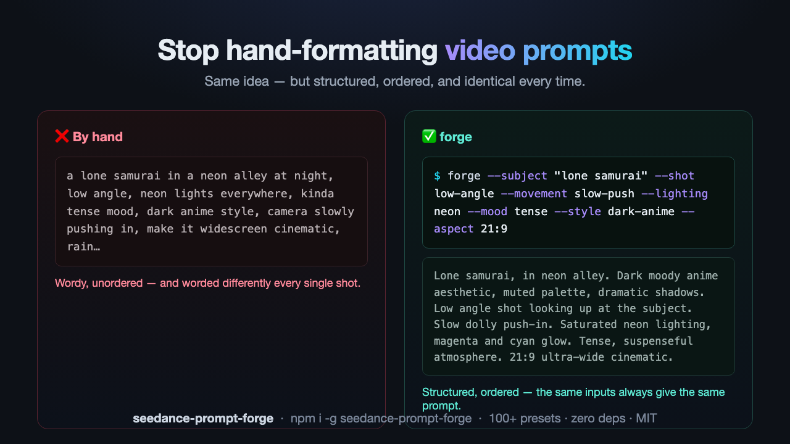

# seedance-prompt-forge

[](https://www.npmjs.com/package/seedance-prompt-forge)
[](https://www.npmjs.com/package/seedance-prompt-forge)
[](https://github.com/thoxakihiko/seedance-prompt-forge/actions/workflows/ci.yml)
[](LICENSE)
[](https://nodejs.org)

> Build clean, structured, consistent video prompts for **Seedance** and other text-to-video models (Kling, Runway, Veo) from simple inputs — instead of hand-formatting every prompt by hand.

`forge` turns a few simple flags into a properly ordered, model-friendly prompt. You stop re-typing the same phrasing, stop forgetting the camera/lighting/style structure, and stop getting inconsistent results because every prompt was written slightly differently.

```bash
forge --subject "lone samurai" --setting "rain-soaked neon alley" \
      --shot low-angle --movement slow-push --lighting neon \
      --mood tense --style dark-anime --pacing slow-motion --aspect 21:9
```

→
> Lone samurai, in rain-soaked neon alley. Dark moody anime aesthetic, muted palette, dramatic shadows. Low angle shot looking up at the subject, heroic and imposing. Slow dolly push-in toward the subject. Saturated neon lighting, magenta and cyan glow. Tense, suspenseful atmosphere. Dramatic slow motion. 21:9 ultra-wide cinematic aspect ratio.

<p align="center">
  
</p>

---

## 🆕 What's new — Seedance 2.5 (v0.2.0)

`forge` now targets **Seedance 2.5 by default**. Seedance 2.0 is still fully supported with `--model seedance-2.0`.

| | Seedance 2.0 | **Seedance 2.5** |
|---|---|---|
| Max single-pass duration | 15s | **30s** |
| References per prompt | not validated by `forge` | **30 images · 10 videos · 10 audio** |
| Multi-round extension (characters/environment stay consistent) | | ✅ new |
| New reference types | | clay render (pose, motion path, camera angle), motion, creative |
| Editing | | timestamp-level, green screen / background replacement, camera perspective, reference-based |

- New `--model` and `--duration` flags. `--duration` is checked against the model's single-pass limit (30s on 2.5, 15s on 2.0) and added to the prompt's technical tail.
- New `forge models` command lists supported models and their limits.
- New library helpers: `getModel`, `validateDuration`, `validateReferences`, `listModels`.
- Prompts built without `--duration` are byte-for-byte identical to v0.1.x.

> **Not yet supported:** the Seedance 2.5 public API isn't released (coming soon via BytePlus ModelArk), and new output resolutions aren't officially confirmed — so `forge` doesn't emit API parameters or resolution presets for 2.5 yet. Source: [ByteDance Seed blog](https://seed.bytedance.com/en/blog/one-take-creation-flexible-referencing-introducing-seedance-2-5).

## ✨ Features

- 🎬 **Structured output** — assembles prompts in the order text-to-video models weight most: subject → style → camera → lighting → mood → pacing → aspect ratio.
- 🎛️ **100+ curated presets** across shots, camera moves, lenses, lighting, mood, style, subject motion, pacing, and aspect ratios.
- ✍️ **Preset key _or_ free text** — every flag accepts a shorthand key *or* your own words. You're never boxed in.
- 🔁 **Consistent by default** — the same inputs always produce the same clean prompt, so a 30-shot project actually feels like one project.
- 📦 **CLI _and_ library** — run `forge` in the terminal or call `buildPrompt()` in code.
- 🪶 **Zero dependencies, 100% local & free** — no API key, no account, nothing phones home.

## Why this exists

Text-to-video models reward prompts that are **structured and ordered** — subject first, then style, camera, lighting, mood, pacing, technical specs. Writing that by hand every time is tedious and error-prone, and small wording differences produce inconsistent results across a project.

`forge` encodes that structure once. You provide the *intent* (samurai, tense, low angle); it handles the *phrasing and ordering* that models respond to. Same inputs always give the same clean output — which matters when you are generating dozens of shots for one project and need them to feel consistent.

## Install

```bash
npm install -g seedance-prompt-forge
```

Or use it as a library in your own project:

```bash
npm install seedance-prompt-forge
```

Requires Node.js 18+.

## Usage

### Command line

```bash
forge --subject "a wooden cabin" --setting "misty pine forest at dawn" \
      --shot extreme-wide --movement crane --lighting blue-hour \
      --mood serene --style cinematic --aspect 16:9
```

See every available preset key:

```bash
forge options
```

Target a model and clip length (Seedance 2.5 is the default, up to 30s per pass):

```bash
forge --subject "a skateboarder" --setting "empty concrete skatepark" --duration 25
forge --subject "a skateboarder" --duration 12 --model seedance-2.0   # 2.0: max 15s
forge models                                                          # list models + limits
```

Full help:

```bash
forge --help
```

### As a library

```js
import { buildPrompt } from "seedance-prompt-forge";

const prompt = buildPrompt({
  subject: "a street vendor",
  setting: "a busy night market",
  shot: "medium",
  lighting: "neon",
  style: "documentary",
});
```

Check limits before you generate:

```js
import { validateDuration, validateReferences } from "seedance-prompt-forge";

validateDuration(28);                          // ok on Seedance 2.5 (max 30s)
validateDuration(28, "seedance-2.0");          // throws — 2.0 max is 15s
validateReferences({ images: 12, videos: 3 }); // ok on 2.5 (≤30 / ≤10 / ≤10)
```

## Flags

| Flag | What it controls | Example values |
|------|------------------|----------------|
| `--subject` *(required)* | Who / what is in the shot | `"lone samurai"` |
| `--action` | What the subject is doing | `slow-walk`, `turn`, `fight` |
| `--setting` | Location / environment | `"neon alley"` |
| `--shot` | Camera shot / framing | `wide`, `close-up`, `low-angle` |
| `--movement` | Camera movement | `slow-push`, `orbit`, `tracking` |
| `--lens` | Lens character | `anamorphic`, `macro`, `telephoto` |
| `--lighting` | Lighting setup | `neon`, `golden-hour`, `low-key` |
| `--mood` | Emotional atmosphere | `tense`, `epic`, `eerie` |
| `--style` | Visual style | `cinematic`, `dark-anime`, `cyberpunk` |
| `--pacing` | Shot pacing | `slow`, `fast`, `slow-motion` |
| `--aspect` | Aspect ratio | `16:9`, `9:16`, `21:9` |
| `--extra` | Any extra free-text detail | `"volumetric fog"` |
| `--model` | Target model (default `seedance-2.5`) | `seedance-2.5`, `seedance-2.0`, `2.0` |
| `--duration` | Clip length in seconds (≤30 on 2.5, ≤15 on 2.0) | `25` |

**Every flag accepts a preset key OR free text.** Unknown values pass straight through, so you are never boxed in by the presets.

## How it works

The prompt is assembled in the order text-to-video models weight most heavily:

1. **Subject + action + setting** (leads, because early tokens carry the most weight)
2. **Visual style**
3. **Camera language** — shot, movement, lens
4. **Lighting + mood**
5. **Pacing**
6. **Extra detail**
7. **Duration + aspect ratio** (technical, goes last)

The vocabulary lives in small, readable modules under [`src/modules/`](src/modules/) — camera, lighting, style, motion. Editing or extending the presets is just editing a plain object.

## More examples

See [`examples/EXAMPLES.md`](examples/EXAMPLES.md).

## Related

- [`shotlist-forge`](https://github.com/thoxakihiko/shotlist-forge) — expands one concept into a full, shot-by-shot prompt *sequence*, built on top of this tool.
- [`awesome-ai-video`](https://github.com/thoxakihiko/awesome-ai-video) — a curated list of AI text-to-video models, tools, and resources.

## Contributing

The preset vocabularies are intentionally simple to extend. Open a PR to add shot types, lighting setups, styles, or motion presets — each lives in its own module file. Issues and suggestions welcome.

## License

MIT — see [LICENSE](LICENSE).
